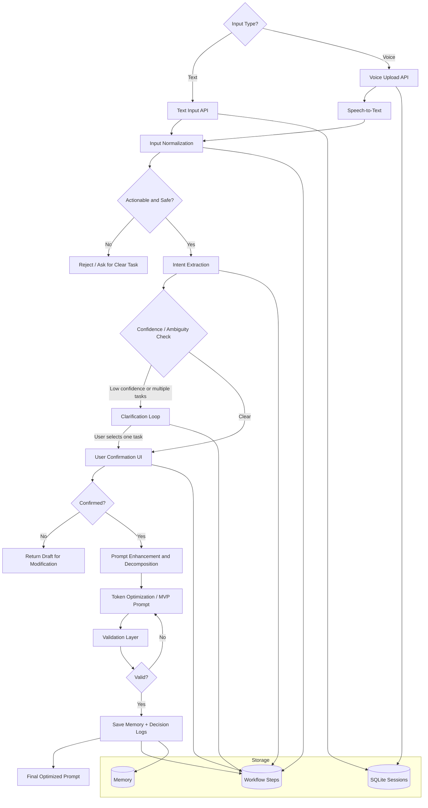

# Voice-Driven Deterministic Prompt Optimization Engine

## Processing Layers

- Input layer: text and voice upload endpoints.
- Normalization layer: removes noise, normalizes Hindi/Hinglish/English input to English, and rejects non-task input.
- Intent layer: extracts task, domain, constraints, output format, audience, and confidence.
- Confirmation layer: blocks execution until the user confirms the interpreted intent.
- Optimization layer: creates a minimum viable prompt and preserves required constraints.
- Validation layer: checks intent alignment, format correctness, and token efficiency.
- Memory/log layer: records save/skip decisions, workflow steps, and final memory output.
